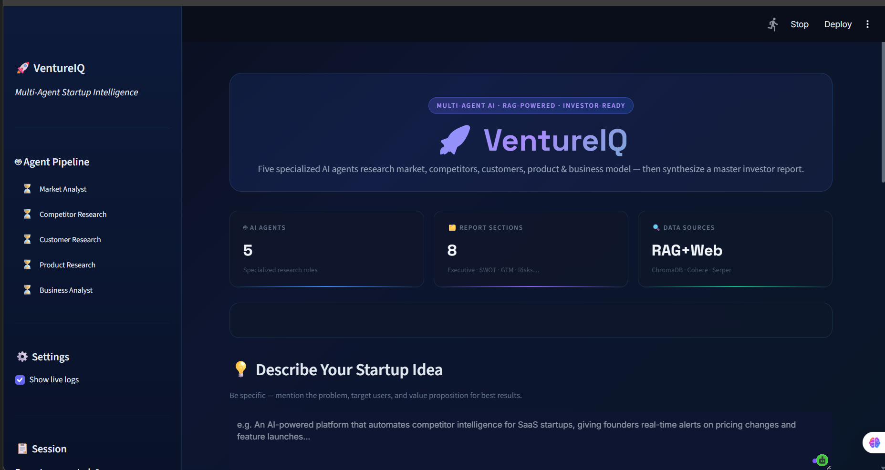

<div align="center">

# 🚀 VentureIQ
### Autonomous Multi-Agent Startup Intelligence & Due Diligence Platform

[](https://www.python.org/downloads/)
[](https://crewai.com)
[](https://www.trychroma.com/)
[](https://cohere.com/)
[](https://streamlit.io/)
[](LICENSE)

<br/>

<!-- ======================================================== -->
<!-- 📸 PROJECT HERO BANNER / DASHBOARD PREVIEW               -->
<!-- Place your screenshot in 'assets/dashboard.png'          -->
<!-- ======================================================== -->
<p align="center">
  
</p>

<p align="center">
  <b>Transform raw startup concepts into exhaustive, investor-ready market intelligence reports in minutes.</b>
</p>

</div>

---

## 📌 What is VentureIQ?

**VentureIQ** is an autonomous multi-agent intelligence platform that automates venture due diligence, market validation, and strategic research for founders, venture capital analysts, and strategy teams.

Instead of spending **30–50 hours** manually researching market sizing, scraping competitor landing pages, reviewing user forums, and building financial assumptions, **VentureIQ coordinates a swarm of 5 specialized AI agents** that iteratively research, cross-examine, persist findings in a vector database, and synthesize an investor-grade **8-section Master Business Analysis Report**.

---

<!-- ======================================================== -->
<!-- 📸 ARCHITECTURE DIAGRAM                                   -->
<!-- Place your diagram in 'assets/architecture.png'          -->
<!-- ======================================================== -->
## 🏗️ System Architecture

<p align="center">
  
</p>

VentureIQ implements a **Store-and-Summary multi-agent design pattern** to prevent context window explosion across sequential workflows:

1. **Persistent Vector Storage (ChromaDB)**: Full multi-page reports, web search snippets, and data points are chunked and stored in a shared vector database.
2. **Context Transmission (CrewAI)**: Downstream agents only receive dense, 5-bullet executive summaries, eliminating context accumulation and token degradation.
3. **On-Demand RAG with Cross-Encoder Reranking**: Any agent requiring deep historical data queries ChromaDB and reranks results with **Cohere Rerank v3.0** for zero-hallucination accuracy.
4. **Deterministic Force-Store Callback**: A Python-level safety hook guarantees 100% of intermediate agent reports are persisted without relying on probabilistic LLM tool triggers.

---

## 🤖 The 5 Autonomous Agents

| Agent | Focus Area | Dynamic Tools | Key Deliverables |
| :--- | :--- | :--- | :--- |
| **1. Market Research Analyst** | Macro Landscape & Sizing | Serper Google Search, ChromaDB Store | TAM, SAM, SOM estimates, 5-year CAGR, industry drivers, and macro tailwinds. |
| **2. Competitor Researcher** | Competitive Intelligence | Serper Search, ChromaDB Store, RAG Tool | Direct & indirect competitor matrix, feature gaps, pricing flaws, and positioning angles. |
| **3. Customer Researcher** | Personas & Buying Psychology | Serper Search, ChromaDB Store, RAG Tool | Ideal customer personas, top 5 verified user pain points, buyer journey, and WTP tiers. |
| **4. Product Researcher** | Solution Architecture & Roadmap | Serper Search, ChromaDB Store, RAG Tool | MoSCoW MVP feature scope, UX/UI benchmarks, recommended tech stack, and 3-phase roadmap. |
| **5. Business Analyst** | Synthesis & Investment Thesis | Cohere Reranked RAG Tool | Master 8-section investor brief, SWOT analysis, unit economics, risks, and viability score. |

---

## 📑 Generated Master Investor Report

Every pipeline execution generates a structured, publication-grade markdown document (`final_report_2.md`) covering:

1. **Executive Summary** — 1-page high-impact investment thesis
2. **Market Size & Sizing Breakdown** — Quantitative TAM, SAM, and SOM with source citations
3. **Competitive Landscape & Market Gaps** — Direct vs. indirect positioning battlecards
4. **Customer Persona & Value Proposition** — Demographics, jobs-to-be-done, and willingness to pay
5. **Product Specification & Architecture** — Core MVP features, UX direction, and tech stack
6. **Go-To-Market (GTM) Strategy** — Customer acquisition channels and launch milestones
7. **Risk Matrix & Mitigation Playbooks** — Top regulatory, market, and execution risks
8. **Final Viability Verdict** — Objective viability score (1–10) with a **Build / Pivot / Avoid** recommendation

---

## 🚀 Quickstart Guide

### 1. Prerequisites
- **Python >= 3.10 and < 3.14**
- **[uv](https://docs.astral.sh/uv/)** package manager (recommended) or standard `pip`

```bash
# Install uv if you don't have it
pip install uv
```

### 2. Clone the Repository
```bash
git clone https://github.com/Sanket22g/VentureIQ-Autonomous-Multi-Agent-Startup-Intelligence-Platform.git
cd VentureIQ-Autonomous-Multi-Agent-Startup-Intelligence-Platform
```

### 3. Install Dependencies
```bash
uv sync
```

### 4. Configure API Keys
Create a `.env` file in the root directory:
```env
# Primary LLM Choice (Groq or Google Gemini)
MODEL=groq/openai/gpt-oss-20b
GROQ_API_KEY=your_groq_api_key_here

# For Web Search & RAG Reranking
SERPER_API_KEY=your_serper_api_key_here
COHERE_API_KEY=your_cohere_api_key_here

# Optional: Google Gemini
GEMINI_API_KEY=your_gemini_api_key_here
CREWAI_TRACING_ENABLED=false
```

---

## 💻 Running the Platform

### Option A: Launch Interactive Web Dashboard (Streamlit)
```bash
uv run streamlit run frontend/app.py
```
Open **[http://localhost:8501](http://localhost:8501)** to access the live dashboard with real-time agent telemetry, progress indicators, interactive prompt inputs, and the report viewer.

### Option B: Run Standalone CLI Pipeline
```bash
uv run run_crew
```
Runs the sequential multi-agent pipeline in your terminal and generates `final_report_2.md`.

---

## 🖼️ How to Add or Change Images in this README

We have created an **`assets/`** folder in the root directory for your images.

### Step 1: Save Your Images
Save your image files into the `assets/` folder:
- **Dashboard screenshot**: save as `assets/dashboard.png`
- **Architecture diagram**: save as `assets/architecture.png`

### Step 2: Push to GitHub
```bash
git add assets/
git commit -m "docs: add dashboard and architecture screenshots"
git push origin main
```
Your images will immediately display on your GitHub repository page!

---

## 🛠️ Tech Stack & Integrations

- **Orchestration**: [CrewAI](https://crewai.com) (Role-playing multi-agent framework)
- **Vector Database**: [ChromaDB](https://www.trychroma.com/) (Persistent local semantic store)
- **Semantic Reranking**: [Cohere](https://cohere.com/) (`rerank-english-v3.0`)
- **Web Search**: [SerperDev](https://serper.dev) (Live Google Search API)
- **LLM Gateway**: [LiteLLM](https://github.com/BerriAI/litellm) (Multi-provider routing & rate-limit resilience)
- **Frontend Dashboard**: [Streamlit](https://streamlit.io/) (Dark-mode responsive analytics UI)

---

## 📄 License
This project is licensed under the [MIT License](LICENSE).
